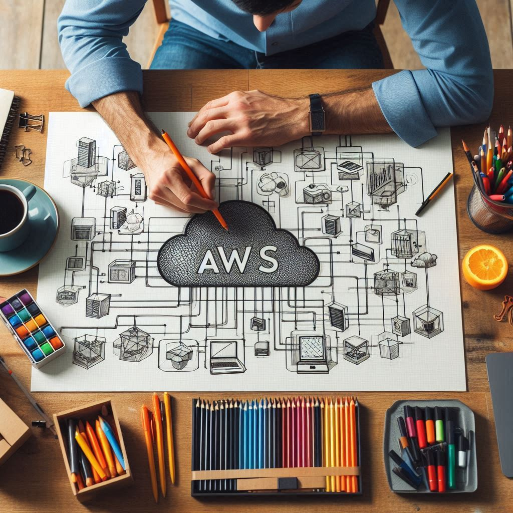

# AWS Labs for Kids

## Introduction
If you are new to AWS or want to have hands-on experience with AWS services, you are in the right place. \
This repository contains a collection of AWS labs which are designed to be simple and easy to follow. Each lab has a scenario, steps, and cleanup instructions. You can follow the steps to complete the lab and learn about AWS services.

## Prerequisites
Labs in this repository assume that you have an AWS account and basic knowledge of AWS services. It's designed for those who want to practice and hands-on with AWS services.

> Note that **"for Kids"** just a fun way to say that these labs are designed for everyone. Don't worry if you are not a kid, you can still follow the labs and learn AWS. :) 

## Labs
1. [EBS Backup Basic](labs/ebs-backup-basic/README.md)
2. [KMS Basic](labs/kms-basic/README.md)
3. [Database Migration Basic](labs/database-migration-basic/README.md)
4. [Location Tracker Sytem](labs/location-tracker/README.md)