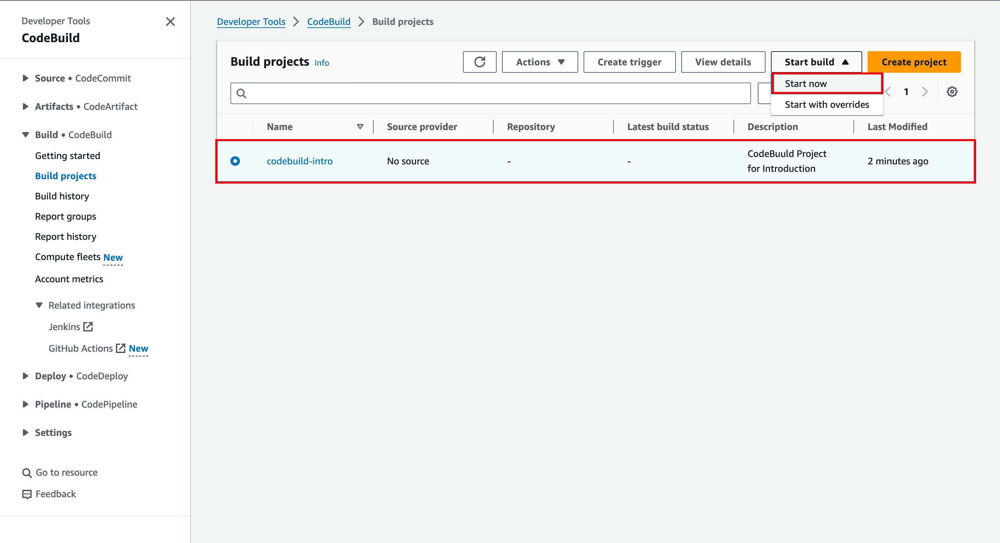
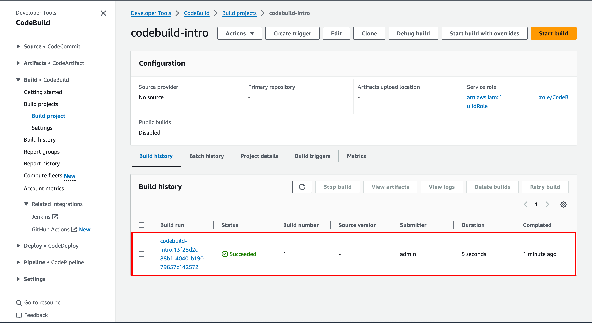
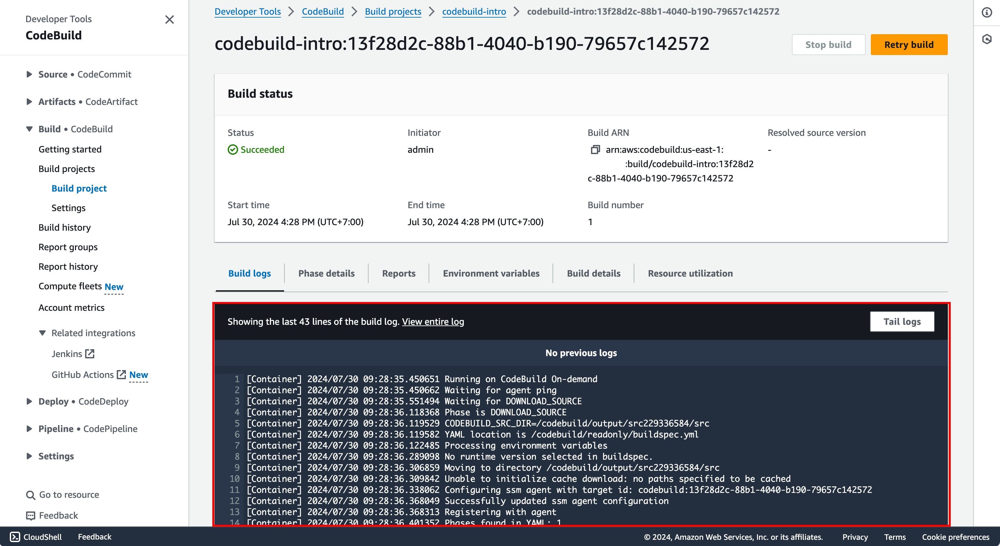

# CodeBuild Introduction

Difficulty: ★ ★ ☆ ☆ ☆

## Overview

In this lab, you will learn how to create a simple CodeBuild project that will execute some simple commands.

## Scenario

You are a developer at a startup company that is building a new web application. You have been tasked with setting up a build pipeline for the project. You have decided to use AWS CodeBuild to automate the build process. For proof of concept, you will create a simple CodeBuild project that will execute some simple commands before moving on to more complex build processes.

## Steps

### 0. Prerequisites

You need to have the following tools installed on your machine:

- [AWS CLI](https://docs.aws.amazon.com/cli/latest/userguide/getting-started-install.html), should be configured with the appropriate permissions, e.g., `AdministratorAccess`.

### 1. Create the CodeBuild Project

The `cfn-templates/codebuild.yaml` file contains the CloudFormation template that defines the CodeBuild project. You can use this template to create the CodeBuild project using the AWS CLI.

```bash
aws cloudformation create-stack --stack-name codebuild-intro --template-body file://cfn-templates/codebuild.yaml --capabilities CAPABILITY_NAMED_IAM
```

As you can see in the template, we don't use any source repository (e.g., CodeCommit, GitHub) for this project. The buildspec content is just a simple echo command. You can modify the buildspec content to run any command you want.
```yml
version: 0.2
phases:
build:
  commands:
    - echo "Hello, World! This is a CodeBuild Project for Introduction"
```
We use the `BUILD_GENERAL1_SMALL` compute type for this project. This is the smallest and cheapest compute type available for CodeBuild. Additionally, the template also create an IAM role that CodeBuild will use. The role has the necessary permissions to write logs to CloudWatch Logs.

### 2. Execute the CodeBuild Project
Remmember that you just have created the CodeBuild project, but you haven't executed it yet. You can execute the build process using the AWS CLI.
```bash
aws codebuild start-build --project-name codebuild-intro
```

Alternatively, you can also use the AWS Management Console to start the build process. Go to the [CodeBuild Console](https://console.aws.amazon.com/codesuite/codebuild/projects), select the `codebuild-intro` project, and click the `Start now` button.


After the build process is complete, you can view the build history and logs in the CodeBuild Console.



Select the build ID to view the build details, including the build logs.



Check the logs to see the output of the build process. You should see the message `Hello, World! This is a CodeBuild Project for Introduction` that was printed by the `echo` command in the buildspec file. Note that
this logs are stored in CloudWatch Logs, so without attaching the IAM role to the CodeBuild project, you wouldn't be able to see the logs because CodeBuild wouldn't have the necessary permissions to write logs to CloudWatch Logs.

### 3. Clean Up
Delete the CloudFormation stack to remove resources created during this lab.
```bash
aws cloudformation delete-stack --stack-name codebuild-intro
```

## Conclusion
In this lab, you learned how to create a simple CodeBuild project that executes some simple commands. 
In the next lab, you will learn how to use CodeBuild to build a simple web application that will be more useful in a real-world scenario.

