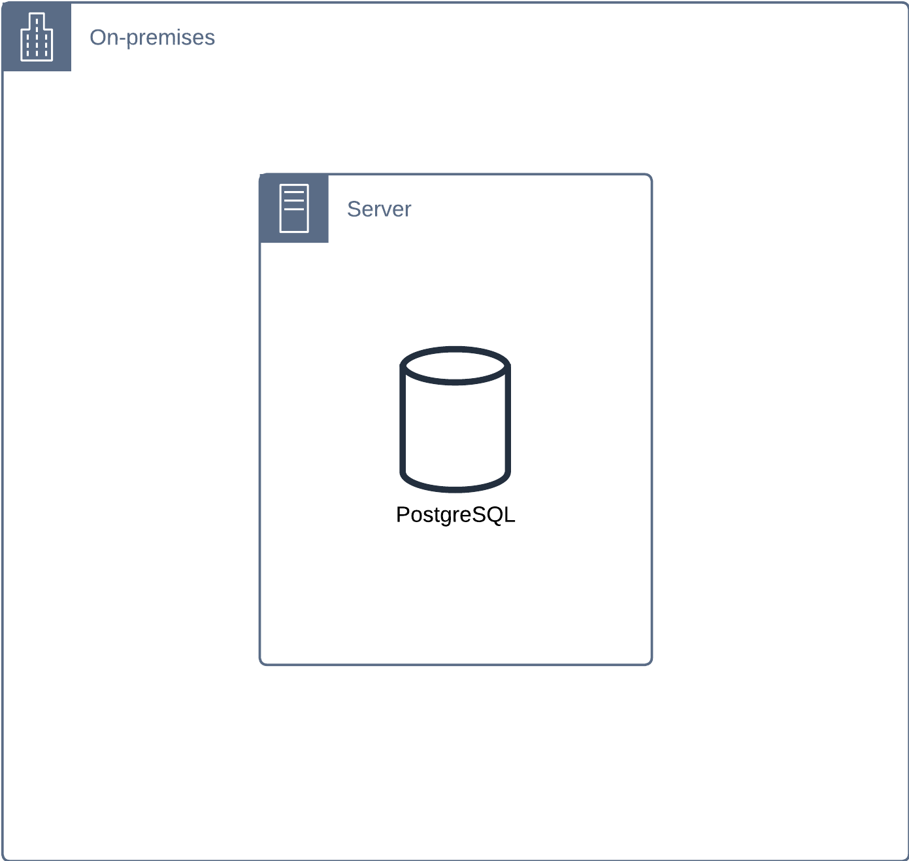
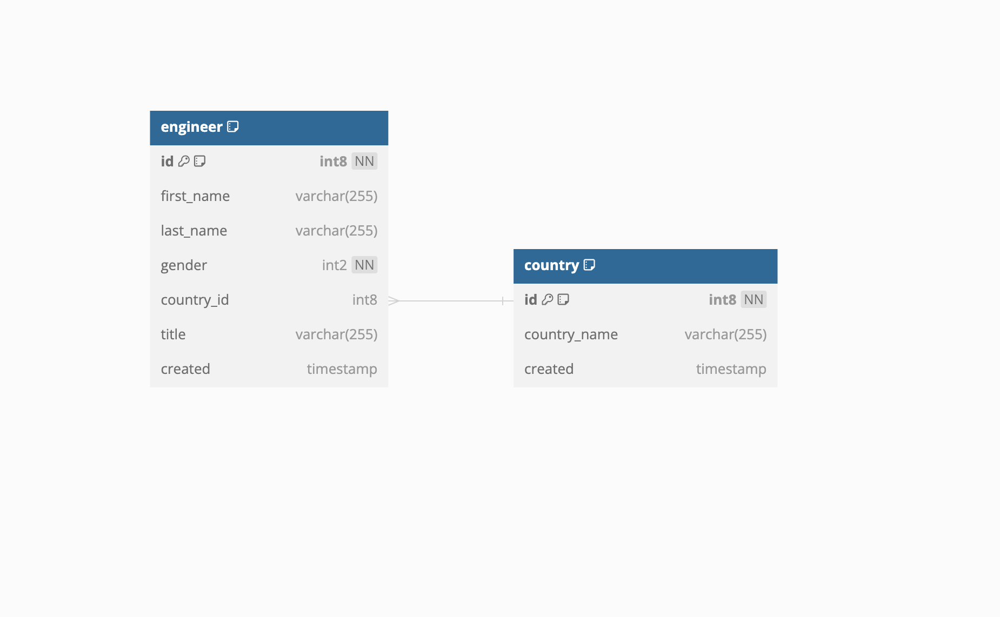
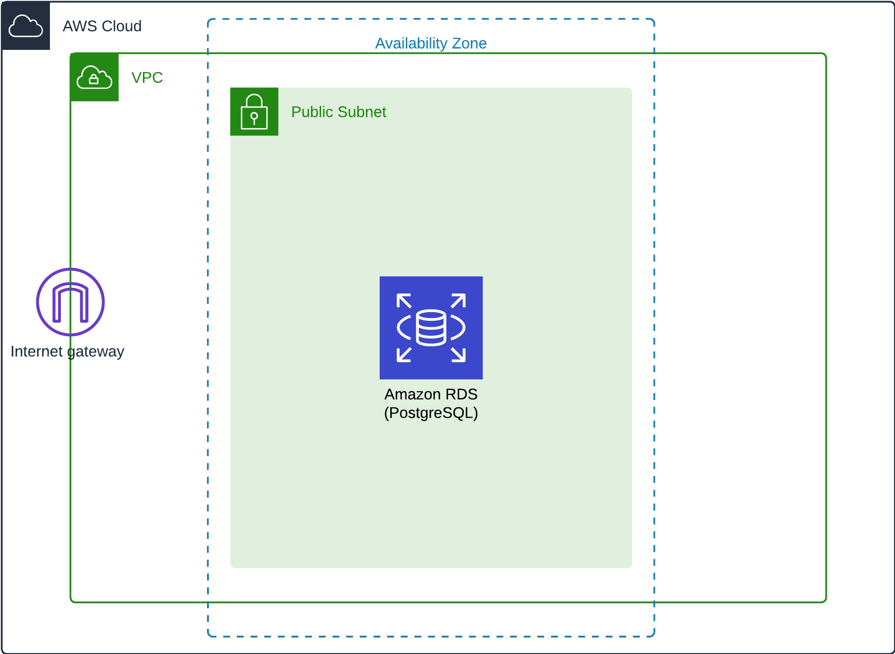
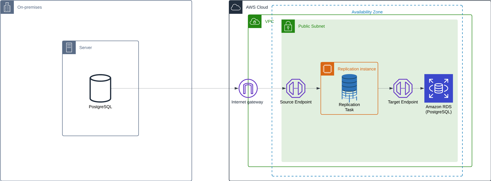

# Database Migration Basic On AWS

Difficulty: ★ ★ ★ ☆ ☆

## Overview

In this lab, you will learn how to migrate a PostgreSQL database from an on-premises environment to AWS RDS using AWS Database Migration Service (DMS).

## Scenario

You are working as a DevOps Engineer for a multinational company using an on-premises PostgreSQL database to store the employee's information. The company is planning to migrate the PostgreSQL database to AWS RDS to reduce the operational overhead of managing the database. You have been tasked to migrate that database to AWS RDS using AWS Database Migration Service (DMS).

## Steps

### 0. Prerequisites

You need to have the following tools installed on your machine:

- [AWS CLI](https://docs.aws.amazon.com/cli/latest/userguide/getting-started-install.html), should be configured with the appropriate permissions, e.g., `AdministratorAccess`.
- A **PostgreSQL client**, e.g., `psql` or any PostgreSQL GUI tool (e.g., pgAdmin, DBeaver, TablePlus) to interact with the database.

### 1. Provision the On-premises system

To be easy to set up, we will also use AWS to provision the On-premises system. We will use a PostgreSQL database running on an AWS EC2 instance and place it in a public subnet so that we can access it from the internet.

You can use the provided CloudFormation template `on-prem.yaml` to provision the On-prem resources:

```bash
aws cloudformation create-stack --stack-name on-prem-system --template-body file://cfn-templates/on-prem.yaml
```

Wait for a few minutes for the stack to be created.



> Alternatively, you can use any other infrastructure provider which you like, e.g., DigitalOcean, Azure, or even your local machine, as long as you can install PostgreSQL on it and ensure it is accessible from the internet.

### 2. Review the provisioned On-prem database


The database is just a simple database, `employees`, that contains two tables:

- `engineer`: Contains 100,000 rows of engineer's information.
- `country`: Contains 240 rows of country's information.

For simplicity, in this lab, we will use the `psql` command-line tool to interact with the `employees` database. Alternatively, you can use any PostgreSQL GUI tool (e.g., pgAdmin, DBeaver, TablePlus) that you are comfortable with.

Now we get the public IP address of the On-prem EC2 instance:

```bash
export ON_PREM_PUBLIC_IP=$(aws cloudformation describe-stacks \
    --stack-name on-prem-system \
    --query "Stacks[0].Outputs[?OutputKey=='PublicIp'].OutputValue" \
    --output text)
```

Use the following command to connect to the `employees` database:

```bash
psql -h ${ON_PREM_PUBLIC_IP} -U postgres -d employees
```

Enter the password `postgres` when prompted.

After connecting to the database, you can use type `\dt` to list all tables in the `employees` database, and you should see two tables: `country` and `engineer`:

```sql
          List of relations
 Schema |   Name   | Type  |  Owner
--------+----------+-------+----------
 public | country  | table | postgres
 public | engineer | table | postgres
```

Get number of rows in the `engineer` table:

```sql
SELECT COUNT(*) FROM engineer; -- 1000000 rows
```

Get number of rows in the `country` table:

```sql
SELECT COUNT(*) FROM country; -- 240 rows
```

You can explore more about the database to understand the data that you will migrate to AWS RDS every time you want.

### 3. Provision the Cloud system

Now that we have the On-premises database set up, we will provision the Cloud system, which includes an RDS instance that we will migrate the database to. You can use the provided CloudFormation template `cloud.yaml` to provision the cloud system's resources and wait for a few minutes for the stack to be created completely:

```bash
aws cloudformation create-stack --stack-name cloud-system --template-body file://cfn-templates/cloud.yaml
```

Wait for a few minutes for the CloudFormation stack to be created.



It simply creates an RDS instance located in a public subnet with the following configurations:

- Database engine: PostgreSQL 16.3
- Database instance class: db.t4g.micro (free tier eligible)
- Master Username: postgres
- Master Password: postgres

> The reason we use a public subnet is to allow the DMS replication instance to connect to the RDS instance. So it makes this lab easier to set up and avoid the complexity of setting up more components. \
> In a real-world project, you should use a private subnet and set up a VPN or Direct Connect to establish a secure connection between the On-premises environment and the Cloud environment.

We can get the endpoint of the RDS instance:
```bash
export RDS_ENDPOINT=$(aws cloudformation describe-stacks \
    --stack-name cloud-system \
    --query "Stacks[0].Outputs[?OutputKey=='RDSEndpoint'].OutputValue" \
    --output text)
```

Connect to the RDS instance using the following command:
```bash
psql -h ${RDS_ENDPOINT} -U postgres
```

Enter the password `postgres` when prompted.

Now we create the `employees` database in the RDS instance that we will migrate the data to:
```sql
CREATE DATABASE employees;
```

### 4. Setup the AWS Database Migration Service (DMS)
To migrate the database from the On-premises system to the Cloud system, we will use AWS Database Migration Service (DMS). AWS DMS is a managed service that makes it easy to migrate databases to AWS quickly and securely.
You can use the provided CloudFormation template `dms.yaml` to provision the DMS resources:
```bash
aws cloudformation create-stack --stack-name dms --template-body file://cfn-templates/dms.yaml --capabilities CAPABILITY_NAMED_IAM
```

Wait for a few minutes for the stack to be created.



The above stack creates the following new resources:
- **A DMS replication instance** is used to connect to the source and target databases and manage the data migration process.
- **A DMS Source Endpoint** is used to connect to the On-premises PostgreSQL database.
- **A DMS Target Endpoint** is used to connect to the RDS PostgreSQL database.
- **A DMS Replication Task** is used to define the migration task, including the source and target endpoints, the migration type, and the table mappings.

### 5. Migrate the database

Now that we have set up the DMS resources, we can start the migration process. We will use the AWS CLI to start the DMS replication task:

```bash
aws dms start-replication-task --replication-task-arn $(aws cloudformation describe-stacks --stack-name dms --query "Stacks[0].Outputs[?OutputKey=='ReplicationTaskArn'].OutputValue" --output text)
```

Wait for a few minutes for the migration task to complete.

### 6. Verify the migration

After the migration task is completed, you can connect to the RDS instance and verify that the data has been migrated successfully.

Note that DMS doesn't migrate indexes, constraints, triggers, or stored procedures. You need to recreate them manually after the migration.

### 7. Clean up
To avoid incurring charges for the resources used in this lab, we need to delete the CloudFormation stacks that we created one by one:
```bash
aws cloudformation delete-stack --stack-name dms
aws cloudformation delete-stack --stack-name on-prem-system
aws cloudformation delete-stack --stack-name cloud-system
```

## Conclusion
In this lab, you have learned how to migrate a PostgreSQL database from an on-premises environment to AWS RDS using AWS Database Migration Service (DMS). You have also learned how to set up the On-premises system, provision the Cloud system, and set up the DMS resources to migrate the database.