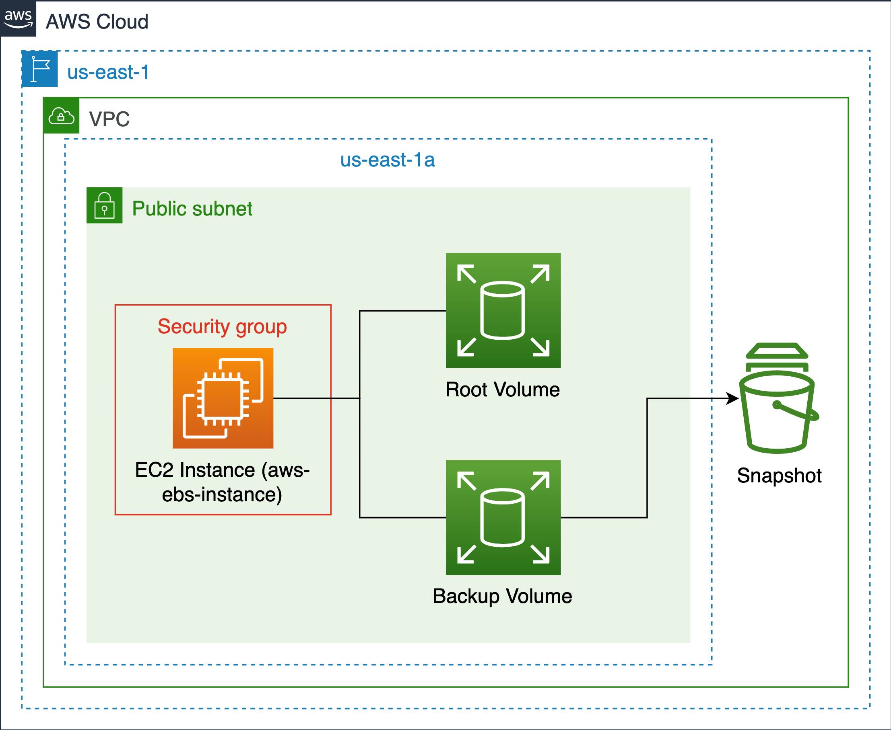

# EBS Backup Basic Challenge
Difficulty: ★ ★ ★ ☆ ☆ 


Source: [Educative.io](https://educative.io)

## Overview:
In this challenge, you will learn how to create a backup of the data stored on an EBS volume attached to an EC2 instance. You will write an app backend server that receives messages from clients and saves them to a data log file. The server should also be able to retrieve the stored messages.

## Scenario:
You are a DevOps engineer at a startup company. The company has a backend server that receives messages from clients and saves them to a data log file. The server should also be able to retrieve the stored messages. The company wants to ensure that the data is backed up in case of any failure. Your task is to create a backup of the data stored on the EBS volume attached to the EC2 instance so that it can be restored in case of any failure.

## Steps:
> IMPORTANT! You must install and configure your AWS CLI with the necessary credentials before proceeding with the steps below.

### 1. Provision the infrastructure with CloudFormation
Set the CloudFormation stack name. Replace `<stack-name>` with any name you want.

```
$ export STACK_NAME=<stack-name>
```

Create the CloudFormation stack and wait for the stack creation to complete.

```
$ aws cloudformation create-stack \
    --stack-name $STACK_NAME \
    --template-body file://cfn-templates/init.yaml \
    --capabilities CAPABILITY_NAMED_IAM
```

### 2. Verify the backend app server
Get the server public IP address of the backend server from the CloudFormation stack outputs:

```
$ export SERVER_PUBLIC_IP=$(aws cloudformation describe-stacks \
    --stack-name $STACK_NAME \
    --query "Stacks[0].Outputs[?OutputKey=='PublicIp'].OutputValue" \
    --output text)
```

Post a message to the backend server

```
$ curl -X POST -H "Content-Type: application/json" -d '{"message": "Hello, World!"}' http://${SERVER_PUBLIC_IP}:3000
```

Retrieve the stored messages from the backend server

```
$ curl http://${SERVER_PUBLIC_IP}:3000
```
If the message is retrieved successfully, the backend server is working as expected.

### 3. Create a snapshot of the EBS volume to backup the data
Get the instance ID from the CloudFormation stack outputs:
```
$ export INSTANCE_ID=$(aws cloudformation describe-stacks \
    --stack-name $STACK_NAME \
    --query "Stacks[0].Outputs[?OutputKey=='InstanceId'].OutputValue" \
    --output text)
```

Get the volume ID of the secondary EBS volume attached to the EC2 instance which contains the stored app messages.
    
```
$ export VOLUME_ID=$(aws ec2 describe-volumes \
    --filters Name=attachment.instance-id,Values=${INSTANCE_ID} \
    --query "Volumes[?Attachments[0].Device == '/dev/sdb'].VolumeId" \
    --output text)
```

Create the snapshot and store the snapshot ID

```
$ export SNAPSHOT_ID=$(aws ec2 create-snapshot \
                --volume-id ${VOLUME_ID} \
                --description "Snapshot of the secondary EBS volume" \
                --query "SnapshotId" \
                --output text)
```
    

### 4. Terminate the EC2 instance.
Now the snapshot has been created, so it's safe to terminate the EC2 instance and remove all the volumes attached to it.
    
```
$ aws ec2 terminate-instances --instance-ids ${INSTANCE_ID}
```
Now the EC2 instance has been terminated, the backend server is no longer accessible, and the data is lost. However, we can restore the data from the snapshot.

### 5. Create a new EC2 instance with the snapshot of the EBS volume
Update the CloudFormation stack with the snapshot ID to create a new EBS volume from the snapshot and attach it to a new EC2 instance.

```
$ aws cloudformation update-stack \
    --stack-name $STACK_NAME \
    --template-body file://cfn-templates/init.yaml \
    --parameters ParameterKey=SnapshotId,ParameterValue=${SNAPSHOT_ID} \
    --capabilities CAPABILITY_NAMED_IAM
```


### 6. Test the new EC2 instance
Get the new server public IP address of the backend server from the CloudFormation stack outputs:

```
$ export NEW_SERVER_PUBLIC_IP=$(aws cloudformation describe-stacks \
    --stack-name $STACK_NAME \
    --query "Stacks[0].Outputs[?OutputKey=='PublicIp'].OutputValue" \
    --output text)
```

Retrieve the stored messages from the backend server

```
$ curl http://${NEW_SERVER_PUBLIC_IP}:3000
```
If the messages are retrieved successfully, the data has been successfully restored from the snapshot.

### 7. Clean up
Delete the CloudFormation stack to clean up all resources.

```
$ aws cloudformation delete-stack --stack-name $STACK_NAME
```

Note that the snapshot is not a part of the CloudFormation stack, so we need to delete the snapshot manually.

```
$ aws ec2 delete-snapshot --snapshot-id ${SNAPSHOT_ID}
```