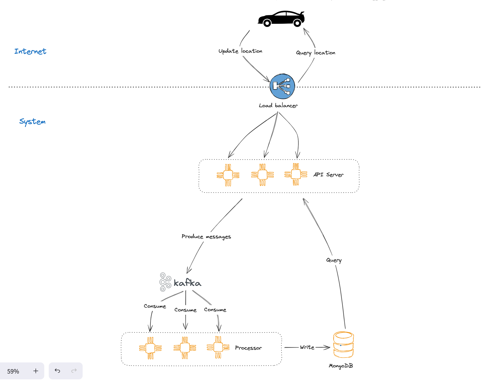

# Location Tracker



# Table of Contents

1. [Overview](#overview)
2. [Components](#components)
    - [API Server](#api-server)
    - [Kafka Cluster](#kafka-cluster)
    - [Processor](#processor)
    - [MongoDB](#mongodb)
3. [Installation](#installation)
    - [Docker Compose (All-in-one)](#docker-compose-all-in-one)
    - [Manual Installation](#manual-installation)

## Overview

Location tracker is a service providing APIs to update and retrieve the locations of devices.

## Components

### API Server

The **API server** is responsible for handling the HTTP requests from the client devices. It provides the following APIs:

#### 1. Update new locations

- Enpoint: `POST /v1/location`
- Content-Type: `application/json`
- Request body:
  ```json
  {
    "info": {
      "car_sku": "MG5_002",
      "entityId": {
        "entityType": "DEVICE",
        "id": "4beac0f0-eb6e-11ee-9c0c-a7e0377c6341"
      }
    },
    "value": [
      {
        "ts": 1721216284146,
        "longitude": "3333.3333",
        "speedOverGround": "200",
        "latitude": "2222.2222"
      }
    ]
  }
  ```

#### 2. Upload locations file

- Endpoint: `POST /v1/location/upload`
- Content-Type: `multipart/form-data`
- File field: `file`
- File content:
  ```json
  {
    "info": {
      "car_sku": "MG5_002",
      "entityId": {
        "entityType": "DEVICE",
        "id": "4beac0f0-eb6e-11ee-9c0c-a7e0377c6341"
      }
    },
    "value": [
      {
        "ts": 1721216284146,
        "longitude": "3333.3333",
        "speedOverGround": "200",
        "latitude": "2222.2222"
      }
    ]
  }
  ```

#### 3. Get the latest locations of a device

- Endpoint: `GET /v1/location/{device_id}`
- Query parameters:
  - `limit`: The number of latest locations to return. Default is 1.
- Response body:
  ```json
  [
    {
      "ts": 1715184377186,
      "longitude": "10743.594002",
      "speedOverGround": "0",
      "latitude": "1038.587898"
    }
  ]
  ```

### Kafka Cluster

The **Kafka cluster** is used to store the location updates of devices. The **API server** will produce the location updates to the Kafka topic, and the **Processor** will consume the location updates from the Kafka topic.

### Processor

The **Processor** are responsible for consuming the location updates of devices from the Kafka topic and storing them in the MongoDB database.

### MongoDB

The **MongoDB** is used to store the location updates of devices.

## Installation
You can run the project with Docker Compose (All-in-one) or manually.

### Docker Compose (All-in-one)

> **Note**: Ensure that you have installed Docker and Docker Compose on your machine.

Edit the `.env` file to set the environment variables as your requirements:
- `MONGO_INITDB_ROOT_USERNAME`: Username of the MongoDB root user.

- `MONGO_INITDB_ROOT_PASSWORD`: Password of the MongoDB root user.

- `MONGO_INITDB_DATABASE`: The database that will be created when the MongoDB container starts.

- `KAFKA_BROKERS`: The list of Kafka brokers. If you run the **API server** or **Processor** manually and directly on your host (not in Docker containers),
 and define `KAFKA_BROKERS` with domain names, for example, `kafka1:9092,kafka2:9092`, you need to add the domain names to the `/etc/hosts` file which points to localhost (`127.0.0.1`) to avoid the connection error.

- `KAFKA_TOPIC`: The topic that `processors` will consume.

- `KAFKA_GROUP_ID`: The Kafka group ID assigned to the `processors`.

- `SERVER_PORT`: The port that the **API server** will listen to.

- `LOG_LEVEL`: The log level of **API server** and **Processor**.

- `MONGO_URI`: The URI pointing to the MongoDB `locations` database used by the **API server** and **Processor**. Do not use the root user to connect to the database on production.

Run the project with the following command:

```
$ docker compose up -d --build
```

### Manual Installation
Ensure that you have installed the following tools on your machine:
- Go 1.22
- MongoDB 7.0
- Kafka 3.5

#### MongoDB setup
Create a new database named `locations` and create a new timeseries collection named `locations`:
```
db.createCollection("locations", {
  timeseries: {
    timeField: "timestamp",
    metaField: "metadata",
    granularity: "seconds",
  },
});
```

#### Run the API server
Set the environment variables in the `.env` file:
- `MONGO_URI`: The URI pointing to the MongoDB `locations` database.
- `KAFKA_BROKERS`: The list of Kafka brokers that have been set up.
- `KAFKA_TOPIC`: The Kafka topic that the **Processor** will consume.
- `SERVER_PORT`: The port that the **API server** will listen to.
- `LOG_LEVEL`: The log level of **API server**.

#### Run the API server:
```
$ go run cmd/server/main.go
```

#### Run the Processor
Set the environment variables in the `.env` file:
- `MONGO_URI`: The URI pointing to the MongoDB `locations` database.
- `KAFKA_BROKERS`: The list of Kafka brokers that have been set up.
- `KAFKA_TOPIC`: The Kafka topic that the **Processor** will consume.
- `KAFKA_GROUP_ID`: The Kafka group ID assigned to the **Processor**.
- `LOG_LEVEL`: The log level of **Processor**.

Run the Processor:
```
$ go run cmd/processor/main.go
```

## Test the project
Suppose the **API server** is running on port 8000.

#### Update new locations:

```bash
curl --location 'http://0.0.0.0:8000/v1/location' \
--header 'Content-Type: application/json' \
--data '{
    "info": {
        "car_sku": "MG5_002",
        "entityId": {
            "entityType": "DEVICE",
            "id": "4beac0f0-eb6e-11ee-9c0c-a7e0377c6341"
        }
    },
    "value": [
        {
            "ts": 1718425133253,
            "longitude": "3333.3333",
            "speedOverGround": "200",
            "latitude": "2222.2222"
        }
    ]
}'
```

#### Get the location of a device that has been updated above:

```bash
curl --location 'http://0.0.0.0:8000/v1/location/4beac0f0-eb6e-11ee-9c0c-a7e0377c6341'
```

For more information, access the Swagger documentation at `http://0.0.0.0:8000/swagger`.
